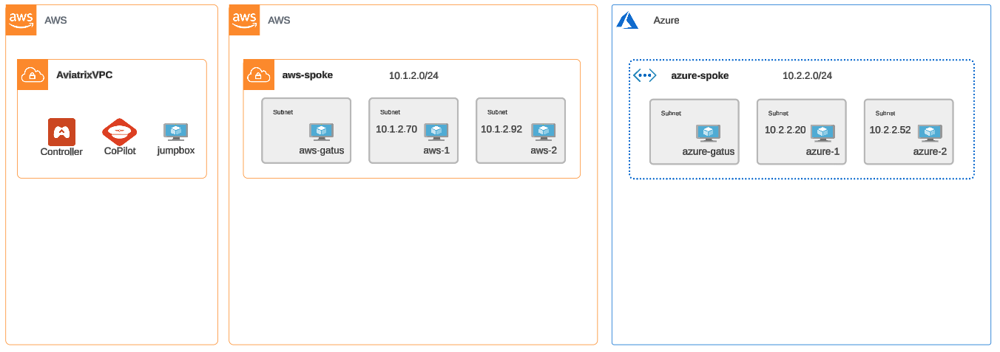
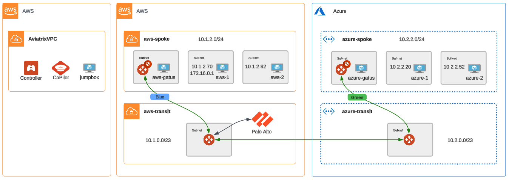

# ace-automation-ilt

## Description

This repository contains the companion code for the ACE (Aviatrix Certified Engineer) Automation instructor-led training.

During this hands on session, you will gain knowledge and learn how to:

* Build and orchestrate intra and multicloud networks.
* Segment, secure and automate routing within your cloud environment.
* Easily insert a NGFW into your east-west data path.
* Enable and implement Aviatrix's distributed cloud firewall to secure connectivity across cloud networks down to the VPC level.

All using only the Aviatrix Terraform provider [resources](https://registry.terraform.io/providers/AviatrixSystems/aviatrix/latest/docs) and [modules](https://registry.terraform.io/namespaces/terraform-aviatrix-modules)

## Topology

The following depicts the initial lab topology deployed for each student.

After completing all lab exercises, the final network topology is as shown.

## Lab Guide

[Ace Automation ILT Lab Guide](https://docs.aviatrixlab.com/ace-automation)
